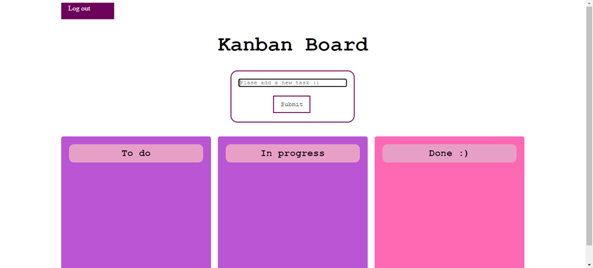

# Rebeca's Kanban board assignemnet 

## Description

Simple Kanban board, that allows to create tasks, move the column of the task and delete the tasks.
Allows for multiple users, given teh simplicity of teh board, I opted for not having password requiremnets, given that I consider it as a way to keep track of the board and not as a security method (i.e., to keep the privacy of the users).

Even when joining the HTML and CSS file togeter makes it run faster, they are separated to dela with the separation of concerns. 

Exclusive use of POST METHODS for the updating. 

The tasks go automatically to the todo board, and it dosent allow the user to decide the status. This was a design choice, with the order of the board in mind, and the fact that the user can move the task to the other columns.

Instead of allowing for editing of the tasks, the user can delete the task and create a new one. This was a design choice, to mantain the simplicity of the board, and the integrity of the tasks. 

The combination of this two design choices, makes the user more concious of every task they want to update (and thus reduces makes them rething what it's posssible to do).

Usually mantaining the least amount of files as possible, allows for a faster run time. Hoever, in this case, I decided to mantain the files separate, to mantain the separation of concerns.

I didn't include the user id as a forgein key, to avoid linking issues. For this version it wasen't necesary becasue the users can't be deleted and I wanted to keep it simple. 

## Testing
The test of the application focuses on the status of the tasks.

I accounted for the posibility of the wrong method, and thus the test takes int into consideration.
I tested every action for the tasks (in multiple ways, such as deleting the a task with a different name.)

The biggest problem with the testing is the problems with having the same user for the whole test (wouldn't allow for the test of multiple users). In total, as seen by the coverage for the app without users is 94% of the code (mostly the functionalities of routes.py). Howevere it reduces to 89% when testing the app with users. 

app\__init__.py     123     28    77%
test.py             164      5    97%
-------------------------------------
TOTAL               287     33    89%

